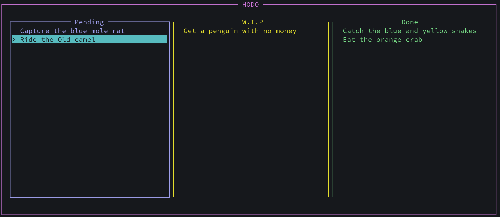

# HODO

A terminal-based (TUI) todo list application written in Haskell, built with the Brick library.



## Usage

- `↑` `↓` `←` `→`: Navigate between items and lists
- `c`: Enter change mode to move selected item
- `r`: Remove selected item
- `a`: Add new item to pending list
- `x`: Modify an item
- `Esc`: Exit current mode

The application loads and saves todo list from `~/.hodo` and can be edited directly.

## Installation

```bash
# Build from source
cabal build
cabal run hodo

# Or using stack to generate the executable
stack install
```

